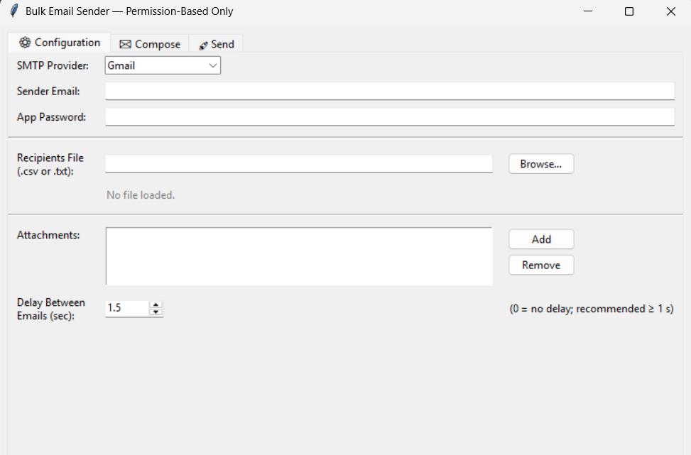

# Bulk-Email-sender
Bulk Email Sender is a web application that allows users to send personalized emails to multiple recipients at once. It supports email templates, recipient list management, and SMTP integration, making large-scale email communication fast, efficient, and easy.

